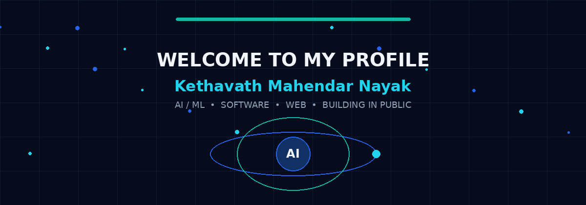
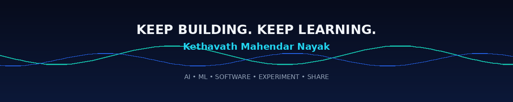

<!-- ===================== HERO ===================== -->

 

  

  

---

## 👋 Hey, I'm Kethavath Mahendar Nayak

I'm a **B.Tech CSE (AI & ML) student at CBIT, Hyderabad**, focused on learning AI deeply while building real software.

### What I care about

- 🤖 Artificial Intelligence & Machine Learning
- 🧠 Generative AI, LLMs and AI Agents
- 💻 Software and Web Development
- 🗄️ Backend, APIs, SQL and databases
- 🚀 Turning ideas into deployable projects
- 🎥 Learning in public and sharing the journey

> **Learn → Understand → Build → Test → Debug → Share → Improve**

---

# 🧰 Tech Stack

### Programming

### Web

### Backend • Database • Tools

**Also:** `REST APIs` · `SQL` · `Backend Development`

---

# 🤖 AI Toolkit

I use AI tools across **coding, research, design, learning, prototyping and product development**.

### 🧑‍💻 Coding & Development

### 🔎 Research & Knowledge

### 🎨 Design & Prototyping

> **AI helps me move faster. Understanding the output helps me build better.**

---

# 🚀 Featured Project

## 🤖 ResumeRanker

An AI-powered resume ranking application that analyzes resumes and ranks them using relevant skills, keywords and content.

**Stack**

`Python` `Flask` `HTML` `CSS` `JavaScript` `SQLite` `Scikit-learn` `TF-IDF`

**Built / learned**

- PDF and DOCX processing
- Text extraction
- TF-IDF based matching
- Flask backend
- Frontend + backend integration
- Database integration
- Deployment

---

# 🧠 My AI Journey

I'm exploring:

`Machine Learning` · `Generative AI` · `LLMs` · `Prompt Engineering` · `AI Agents` · `AI-assisted Development`

---

# 🎥 Learning in Public

I'm documenting my journey through **AI learning, development, projects and experiments with modern AI tools**.

The goal is not to know everything.

The goal is to **keep learning and keep building**.

---

# 📊 GitHub Activity

  

  

---

# 🐍 Contribution Snake

<picture>
  <source media="(prefers-color-scheme: dark)" srcset="https://raw.githubusercontent.com/mahendar-tech367/mahendar-tech367/output/github-snake-dark.svg"/>
  <source media="(prefers-color-scheme: light)" srcset="https://raw.githubusercontent.com/mahendar-tech367/mahendar-tech367/output/github-snake.svg"/>
  
</picture>

---

# 🎯 2026 → 2029

| Stage | Focus |
|---|---|
| **Now** | Programming • DSA • Web • Backend |
| **Next** | Machine Learning • Deep Learning |
| **Then** | LLMs • Generative AI • AI Agents |
| **Always** | Build • Deploy • Experiment • Share |

---

# 💡 Engineering Mindset

> **01** — Don't blindly copy AI-generated code. Understand it.  
> **02** — Build projects instead of only collecting tutorials.  
> **03** — Learn the fundamentals behind the tools.  
> **04** — Experiment with new technology.  
> **05** — Share the journey.  
> **06** — Keep improving.

---

# 📫 Connect With Me

### Building something with AI? Let's connect.

 

  

 

