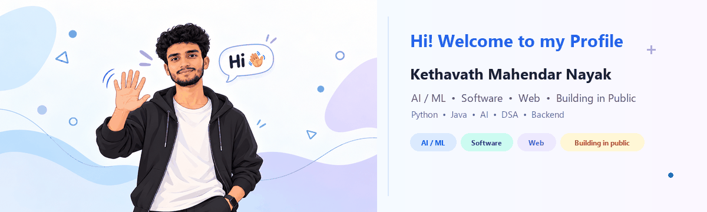
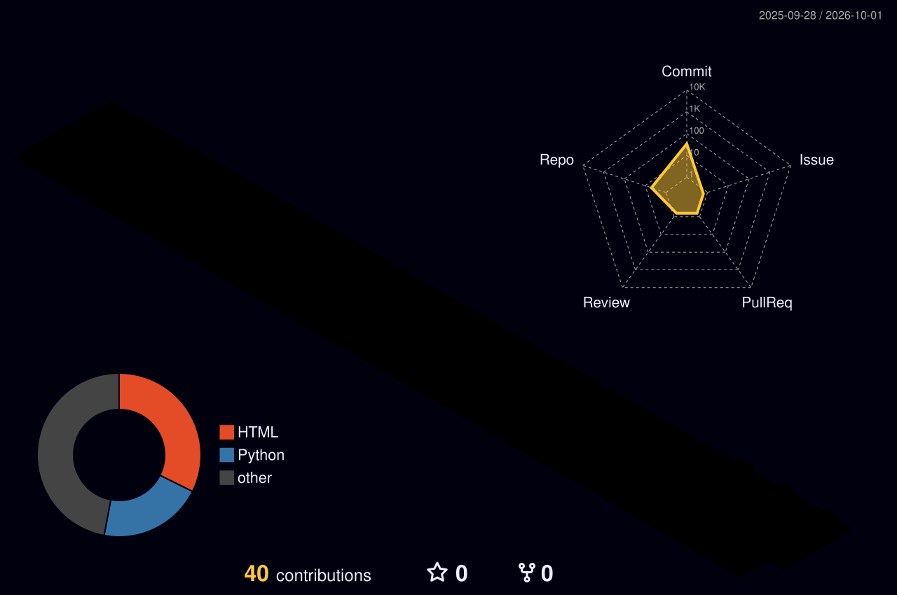

<h1 style="color:#2563EB;">Kethavath Mahendar Nayak</h1>

<strong>B.Tech CSE (AI &amp; ML) student at CBIT Hyderabad</strong>

  <a href="https://github.com/mahendar-tech367">GitHub</a> ·
  <a href="https://linkedin.com/in/mahendarnayak367/">LinkedIn</a> ·
  <a href="https://instagram.com/withmahendar">Instagram</a>

<em>Learning AI/ML, building for the web, and sharing the journey.</em>

---

## About me

I’m a Computer Science student specializing in Artificial Intelligence and Machine Learning at **CBIT, Hyderabad**. I’m exploring AI/ML through hands-on projects while strengthening my foundations in data structures and algorithms. I also enjoy **web design**—especially shaping clear, thoughtful interfaces—and creating content about what I learn.

This profile brings together my projects, learning path, and contribution activity. I’m looking forward to documenting my future **GATE** preparation journey here as well.

## What I’m learning and building

- **AI & machine learning:** growing from core concepts to practical applications
- **Data structures and algorithms:** learning, practicing, and sharing progress
- **Web design:** creating clean, readable, user-focused experiences
- **Content creation:** making content around AI learnings and DSA
- **Next chapter:** preparing to share my GATE journey

## Featured projects

| Project | What it is |
| --- | --- |
| [ResumeRanker](https://github.com/mahendar-tech367/ResumeRanker) | An AI-focused project exploring resume ranking. |
| [ArravMath-first-AIAgent](https://github.com/mahendar-tech367/ArravMath-first-AIAgent) | An early project exploring an AI agent for math. |
| [Calculator](https://github.com/mahendar-tech367/Calculator) | A calculator project and hands-on software build. |

## Skills and interests

  
  
  
  

My current focus is to turn what I learn into small, practical projects, improve my problem-solving step by step, and share useful takeaways along the way.

## Education

**B.Tech, Computer Science and Engineering (AI & ML)**  
CBIT · Hyderabad

## My journey

`LEARN` &nbsp; → &nbsp; `BUILD` &nbsp; → &nbsp; `SHARE` &nbsp; → &nbsp; `GROW`

- **Now:** building my AI/ML foundations, practicing DSA, and exploring web design.
- **Along the way:** sharing content about my learning and projects.
- **Up next:** documenting my GATE preparation journey.

## GitHub activity

## Contribution garden

These images are generated by the GitHub Actions workflows in this repository. The Snake workflow publishes its files to the `output` branch; the 3D contribution workflow generates its image in the repository. Once each workflow has run successfully, the images below will appear here.

<picture>
  <source media="(prefers-color-scheme: dark)" srcset="https://raw.githubusercontent.com/mahendar-tech367/mahendar-tech367/output/github-contribution-grid-snake-dark.svg" />
  <source media="(prefers-color-scheme: light)" srcset="https://raw.githubusercontent.com/mahendar-tech367/mahendar-tech367/output/github-contribution-grid-snake.svg" />
  
</picture>

 

## Find me

- **GitHub:** [@mahendar-tech367](https://github.com/mahendar-tech367)
- **LinkedIn:** [linkedin.com/in/mahendarnayak367](https://linkedin.com/in/mahendarnayak367/)
- **Instagram:** [@withmahendar](https://instagram.com/withmahendar)

---

  Designed with a calm, light palette: white · royal blue <code>#2563EB</code> · teal <code>#14B8A6</code>. Readable system fonts keep the profile accessible across devices.

